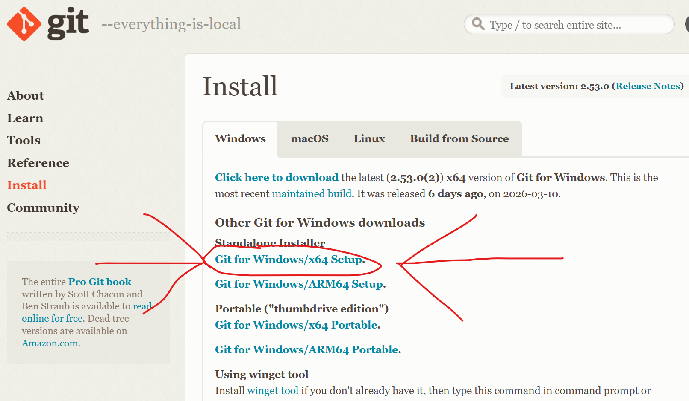

# git 강의(클로드가 쓰고, 본인이 검수함)

# Git & GitHub 완전 입문 가이드

## 🤔 Git이 뭔데?

코드를 짜다 보면 이런 상황이 생겨:

`최종.zip
최종_진짜최종.zip
최종_진짜최종2.zip
최종_이번엔진짜.zip`

**Git은 이 짓을 안 해도 되게 해주는 버전 관리 도구야.**

코드의 변경 이력을 전부 기록해둬서, 언제든지 과거로 돌아갈 수 있어. 마치 게임의 세이브 포인트처럼.

---

## 🌐 GitHub는 또 뭔데?

Git은 **내 컴퓨터 안에서** 동작하는 도구야.
GitHub는 그 기록을 **인터넷 서버에 올려두는 플랫폼**이야.

|  | Git | GitHub |
| --- | --- | --- |
| 정체 | 도구 (프로그램) | 웹사이트 (서비스) |
| 역할 | 버전 기록 | 원격 저장 + 협업 |
| 인터넷 필요? | ❌ | ✅ |

> 비유하자면, Git은 **일기장**, GitHub는 그 일기장을 올려두는 **구글 드라이브**야.
> 

---

## 📦 핵심 개념 3가지

### 1. Repository (리포지토리, 줄여서 레포 또는 리포)

그냥 **프로젝트 폴더**야. Git이 관리하는 폴더.

### 2. Commit (커밋) (저장의 느낌)

**세이브 포인트 하나**. "지금 이 상태를 기록해둔다"는 행위야.

커밋마다 메시지를 남겨서 뭘 바꿨는지 적어둬.

### 3. Branch (브랜치) (영어 뜻은 가지)

**평행 세계**라고 생각하면 돼.

메인 코드는 건드리지 않고, 새 기능을 따로 개발할 수 있어.

다 됐으면 메인에 합치면 됨 (이걸 **merge**라고 해).

`main  ─────●─────────────────●─────
                \           /
feature          ●───●───●`

**feature브랜치는 만들 당시에 main과 100% 똑같다.**

**이제 이 feature 브랜치에서 새 기능도 추가하고 개발하고 테스트도 다 하고 잘 되면**

**main 브랜치에 Merge(머지, 병합) 하는거다.**

**근데 꼭 브랜치를 만들어서 할 필요는 없다. 개발자 마음이다.**

---

## ⚙️ 설치 & 초기 설정

### Git 설치

👉 [https://git-scm.com/install/windows](https://git-scm.com/install/windows) 에서 다운로드

(포터블 말고 64bit Setup 추천!)

### 처음 한 번만 하는 설정

bash

`git config --global user.name "이름"
git config --global user.email "이메일@gmail.com"`

커밋할 때 **"누가 했는지"** 표시되는 이름이야.

깃허브 계정도 이메일이 똑같아야함.

---

## 🔨 자주 쓰는 명령어

### 새 프로젝트 시작할 때

bash

`git init          # 이 폴더를 Git으로 관리 시작`

위 이미지는 “Visual Studio Code” 일명 VSCode에서의 모습.

이런 IDE(코드 에디터) 그래픽 인터페이스 화면으로도 Git 작업 충분히 가능.

### 매일 쓰는 기본 흐름

bash

`# 1. 현재 상태 확인 (뭐가 바뀌었나)
git status

# 2. 변경된 파일을 "커밋 준비" 상태로 올리기
git add 파일명      # 특정 파일만
git add .          # 전부 다

# 3. 세이브 포인트 찍기
git commit -m "로그인 기능 추가"`

커밋하는 모습

### GitHub에 올리기

bash

`# 처음 연결할 때
git remote add origin https://github.com/유저명/레포이름.git

# 올리기
git push origin main

# 내려받기
git pull origin main`

---

## 🚀 GitHub 첫 시작 순서

1. [github.com](https://github.com/) 에서 회원가입(매크로 및 봇 방지를 위해 비쥬얼 퍼즐 or 오디오 퍼즐 10개정도 풀어야 함)
2. 우측 상단 `+` → **New repository** 클릭

1. 레포 이름 정하고 생성
2. 터미널에서 아래 입력: **(아래 명령어를 입력해도 되지만..사실 코드 에디터에서 버튼 딸깍으로 다 가능. 그러나 명령어 알면 좋지)**

bash

`git init
git add .
git commit -m "첫 커밋"
git remote add origin https://github.com/유저명/레포이름.git
git push -u origin main`

💡 실전 팁

- 커밋 메시지는 나중에 내가 봐도 알 수 있게 구체적으로 써  
  ❌ `수정함` → ✅ `회원가입 유효성 검사 버그 수정

- 자주 커밋해. 큰 덩어리로 한 번보다 작게 여러 번이 훨씬 좋아.

- `.gitignore` 파일 만들어서 올리면 안 되는 파일 제외시켜  
  (비밀번호 담긴 `.env` 파일 같은 거)
**깃이그노어는 깃에게 "이 파일들은 추적하지 말아라" 하는 지침 파일.**

 🗺️ 전체 흐름 요약

`내 컴퓨터                          GitHub 서버
─────────────────────────────────────────────────
[작업 폴더] → git add → [준비 공간] → git commit → [로컬 기록]
                                                         │
                                                    git push
                                                         │
                                                   [원격 저장소]`

---

처음엔 `add → commit → push` 이 세 개만 외워도 충분해. 나머지는 쓰다 보면 자연스럽게 익혀져. 👍

**참고로 Git은 오픈소스이고 무료이기 때문에 소스코드를 볼 수 있고**

**Github 말고도 Git 호스팅 서비스는 많다.**

**Sourceforge, Gitlab, Gitea등이 있다.**

**여기서 Gitea는 개인 개발자가 자기 서버용 컴퓨터에 직접 깔아서 GIthub처럼 쓸수 있는 오픈소스 프로그램이다.**

## **코드 에디터 및 IDE 추천:**

안티그래비티 다운로드: [https://antigravity.google/download](https://antigravity.google/download) **(ARM64버전 다운로드) (만약 사용하기 위한 구글 계정의 생일이 만18세 미만으로 설정되어 있다면 핸드폰에서 새 구글 계정을 생성할 것.)**

## **프라이빗 리포 vs 퍼블릭 리포:**

퍼블릭: 누구나 볼 수 있음

프라이빗: 나 및 내가 추가한 몇몇 콜라보레이터(협업자) 외엔 존재 자체를 알 수 없음.

## 깃허브 데스크탑 이란 것도 있는데 얘는 코드 에디터는 아니고

git이 설치되어 있는 컴퓨터에서 Git작업을 더 보기 좋은 GUI로 할수 있게 해주는 프로그램이다.

https://desktop.github.com/download/